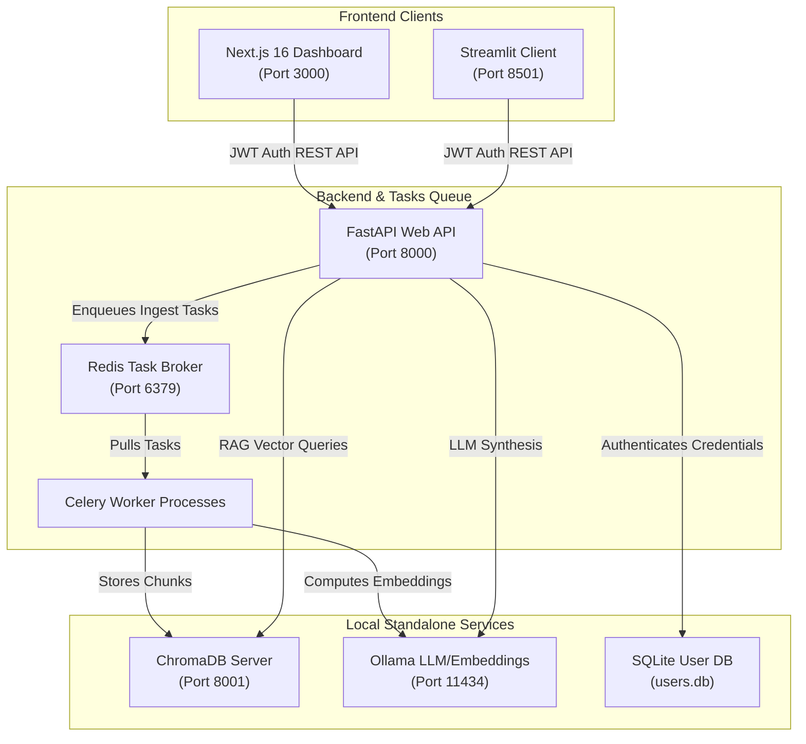

# CogniFlow // Local-First RAG-Powered Document Intelligence Platform

CogniFlow is a secure, local-first Multi-Tenant Retrieval-Augmented Generation (RAG) platform. It parses documents (PDF, DOCX, TXT, MD), indexes them using local embeddings with Ollama, stores them in ChromaDB, and performs high-reasoning query synthesis using a customizable switchboard of either local LLMs or optional cloud APIs.

The system features two user clients:
1. **Next.js 16 Dashboard**: A premium, dark-themed, glassmorphic operations console displaying real-time server diagnostics, document libraries, search expansion strategy selectors, real-time ingestion status trackers, and citation previews.
2. **Streamlit companion client**: A lightweight operational UI cockpit.

---

## System Architecture



---

## Core Features

- **Multi-Tenant Document Isolation**: Secure token-based registration and logins. User documents and search namespaces are dynamically isolated and partitioned into private collection spaces (e.g. `public_username`).
- **Asynchronous Background Task Queue (Celery & Redis)**: Long-running file uploads and arXiv crawls are offloaded to a background task worker queue. Progress is tracked via real-time progress bars in both Next.js and Streamlit clients.
- **Neural Query Re-ranking (Cross-Encoder)**: Optional secondary semantic re-ranking pass using `sentence-transformers` (`BAAI/bge-reranker-base`) to score retrieved candidate chunks, sorting them by precision before LLM response synthesis.
- **Advanced Retrieval Strategies**:
  - **Baseline**: Top-K vector search with Cosine distance relevance filters.
  - **HyDE (Hypothetical Document Embeddings)**: Simulates response templates first to enhance semantic similarity.
  - **Multi-Query with RRF**: Expands query variations and merges retrieval outcomes using Reciprocal Rank Fusion (RRF).
  - **FLARE**: Evaluates confidence for generated sentences and triggers active search expander lookups if grounding confidence drops.
- **Offline Embeddings**: Ingests files privately using `nomic-embed-text` locally.
- **Optional Cloud Switchboard**: Uses local completions by default, but redirects synthesis to `gemini-2.5-flash` if `GEMINI_API_KEY` is provided.

---

## Local Development & Installation

### Prerequisites
1. **Ollama**: Download and run [Ollama](https://ollama.com). Pull embedding and LLM models:
   ```bash
   ollama pull nomic-embed-text
   ollama pull llama3.2
   ```
2. **Redis Server**: A running Redis instance for Celery task dispatching.
3. **Node.js 20+** (for Next.js 16 frontend).
4. **Python 3.11 - 3.12** (for FastAPI backend & Streamlit).

---

### Running the Services Locally

#### 1. Start the FastAPI Backend
```bash
cd backend
python -m venv .venv
# Activate virtualenv (Windows)
.venv\Scripts\activate
# Install dependencies
pip install -e .
# Or if using uv:
uv sync

# Run backend development server
uvicorn app.main:app --reload --host 127.0.0.1 --port 8000
```

#### 2. Start the Celery Ingestion Worker
Ensure Redis is running locally on port 6379, then start the Celery worker from the backend directory:
```bash
cd backend
# Activate virtualenv
.venv\Scripts\activate
# Start Celery worker
celery -A app.celery_app.celery_app worker --loglevel=info
```

#### 3. Start the Next.js Dashboard
```bash
cd frontend
npm install
npm run dev
```
- Open Dashboard: [http://localhost:3000](http://localhost:3000)

#### 4. Start the Streamlit Companion Client
```bash
cd streamlit_client
pip install streamlit httpx
streamlit run streamlit_app.py
```
- Open Streamlit: [http://localhost:8501](http://localhost:8501)

---

## Running with Docker Compose

To build and run the entire multi-tenant infrastructure stack (Web App, Next.js, Streamlit, Celery worker pool, Redis task broker, Standalone ChromaDB, and self-contained auto-downloading Ollama service) in one command:

```bash
docker compose up --build
```

- **Next.js Dashboard**: [http://localhost:3000](http://localhost:3000)
- **Streamlit Client**: [http://localhost:8501](http://localhost:8501)
- **FastAPI API Documentation**: [http://localhost:8000/docs](http://localhost:8000/docs)

*Note: On first boot, the `cogniflow_ollama_setup` container will wait for the Ollama engine to boot, and pull the required `nomic-embed-text` and `llama3.2` models automatically.*
