# DocMind // Local-First RAG-Powered Document Intelligence Platform

DocMind is a robust, local-first Retrieval-Augmented Generation (RAG) platform. It parses documents (PDF, DOCX, TXT, MD), indexes them using local embeddings with Ollama, stores them in ChromaDB, and performs high-reasoning query synthesis using a customizable switchboard of either local LLMs or optional cloud APIs.

The system features two user clients:
1. **Next.js 15 Dashboard**: A premium, dark-themed, glassmorphic operations console displaying real-time server diagnostics, document libraries, search expansion strategy selectors, and citation previews.
2. **Streamlit companion client**: A lightweight operational UI.

---

## System Architecture

```mermaid
graph TD
    subgraph Frontend Clients
        NextJS["Next.js 15 Dashboard<br>(Port 3000)"]
        Streamlit["Streamlit Client<br>(Port 8501)"]
    end

    subgraph Backend Services
        API["FastAPI App (Port 8000)"]
        Ingest["Parallel Ingestion Pipeline"]
        RAG["RAG Search Engine"]
    end

    subgraph local & cloud stores
        Chroma["ChromaDB SQLite Index"]
        Ollama["Local Ollama Embeddings"]
        Gemini["Optional Gemini API"]
    end

    NextJS -->|REST API| API
    Streamlit -->|REST API| API
    API --> Ingest
    API --> RAG
    Ingest -->|Embed| Ollama
    Ingest -->|Store| Chroma
    RAG -->|Query| Chroma
    RAG -->|Synthesize| Ollama
    RAG -->|High-Reasoning| Gemini
```



---

## Features

- **Advanced Retrieval Strategies**:
  - **Baseline**: Top-K vector search with Cosine distance relevance filters.
  - **HyDE (Hypothetical Document Embeddings)**: Simulates response templates first to enhance semantic overlap during index lookups.
  - **Multi-Query with RRF**: Expands query variations and merges retrieval outcomes using Reciprocal Rank Fusion (RRF).
  - **FLARE**: Evaluates confidence for generated sentences and triggers active search expander lookups if grounding confidence drops.
- **Offline Embeddings**: Ingests files privately using `nomic-embed-text` locally.
- **Optional Cloud Switchboard**: Uses local completions by default, but redirects synthesis to `gemini-2.5-flash` if `GEMINI_API_KEY` is provided.

---

## Local Development & Installation

### Prerequisites
1. **Ollama**: Download and run [Ollama](https://ollama.com). Pull embedding and LLM models:
   ```bash
   ollama pull nomic-embed-text
   ollama pull llama3.2 # or llama3
   ```
2. **Node.js 18+** (for Next.js frontend)
3. **Python 3.10 - 3.12** (for FastAPI backend & Streamlit)

---

### Running the Services Locally

#### 1. Start the FastAPI Backend
```bash
cd backend
python -m venv .venv
# Activate virtualenv (Windows)
.venv\Scripts\activate
# Install dependencies using uv or pip
pip install -r requirements.txt

# Run backend development server
uvicorn app.main:app --reload --host 127.0.0.1 --port 8000
```
- API Docs will be available at: [http://localhost:8000/docs](http://localhost:8000/docs)

#### 2. Start the Next.js Dashboard
```bash
cd frontend
npm install
npm run dev
```
- Open Dashboard: [http://localhost:3000](http://localhost:3000)

#### 3. Start the Streamlit Companion Client
```bash
cd streamlit_client
pip install streamlit httpx
streamlit run streamlit_app.py
```
- Open Streamlit: [http://localhost:8501](http://localhost:8501)

---

## Running with Docker Compose

To build and run all services (Backend, Next.js, and Streamlit) inside isolated containers:

```bash
docker-compose up --build
```

- **Next.js Dashboard**: [http://localhost:3000](http://localhost:3000)
- **Streamlit Client**: [http://localhost:8501](http://localhost:8501)
- **FastAPI API Documentation**: [http://localhost:8000/docs](http://localhost:8000/docs)

*Note: Ensure Ollama is running on your host machine. The Docker containers will resolve it via `host.docker.internal`.*
